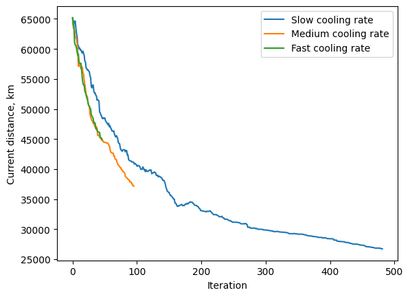

# Assignment 2 (STDSR)
Solution for Task 2 of Assignment 2 for SRDSR course
Implementation of Simulated Annealing for finding the optimal traveling salesman path.
The algorithm is the following:
1. Sample initial $x_0$, set time step t=0;
2. Set initial temperature T. To avoid problems with numerical overflow when calculating the exponent, set the temperature comparable with the initial value of the system’s energy;
3. Generate x′ from g(x′|$x_t$):
   * Pick two cities in the path;
   * Exchange their positions in the path;
   * Return the new proposed path.
4. Calculate acceptance ratio $\alpha=\frac{p^*(x′)}{p^*(x_t)};
5. Generate $u\sim U(0,1)$.  If $u\leq \alpha$, accept the new state $x_{t+1}=x′$, otherwise propagate the old state.  Pass $x_{t+1}$ to the output of the sampler;
6. Reduce temperature T.
7. Increment t;
8. Repeat 2-8 until cooled down. The solution can be sampled before the system is cooled down, but we have no way of knowing whether this was the optimal solution

For the algorithm, 3 temperature annealing rates were tested: 0.99 (slow), 0.95 (medium), 0.9 (fast). For each of them, the algorithm was run 10 times to ensure that the findings are not random. For all runs, the initial and stopping temperatures were set to 2500 and 20 correspondingly. The results are the following:
| Temperature annealing rate | Average final objective value, km | Average processing time of one run, sec | Number of iterations |
|----------------------------|-----------------------------------|-----------------------------------------|----------------------|
| 0.9                        | 44875.2                           | 0.29                                    | 47                   |
| 0.95                       | 37166.72                          | 1.67                                    | 96                   |
| 0.99                       | 26726.07                          | 3.43                                    | 482                  |

This shows that with lower annealing rate, the algorithm require less computation time, but converges to a less optimal path.
Also, I visualized the change in the objective value during the optimization:

As it can be seen, the fast and medium annealing rates show approximately equal convergence speed which is greater than for slow annealing rate. However, as was said before, with slow annealing rate, the algorithm converge to a more optimal value. Hence, the choice of the annealing rate depends on the desired trade-off between the processing time and the accuracy.